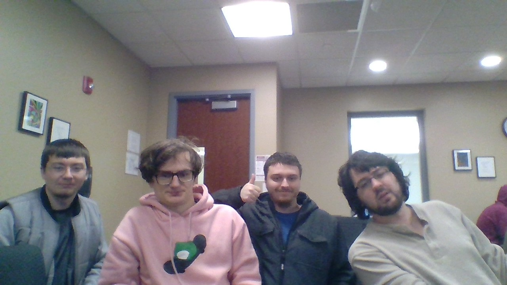

# Scrum Process

We will be using the Scrum framework as our team project managment process.

The tools that we are using to help communicate to each other are: 
- Trello as our source to manage who does what task.
- Discord as a to send message, voice chat, and screen sharing 
- Github as our version control
- others
  - email
  - Zoom
  - gamejolt

## Team Roles
- Bryan - Product Owner
- Malik - Member
- Diya - Member
- Kyle - Scrum Master
- Adrian - Member
- Paula - Member

## Team Schedules

Our times are located here: 

